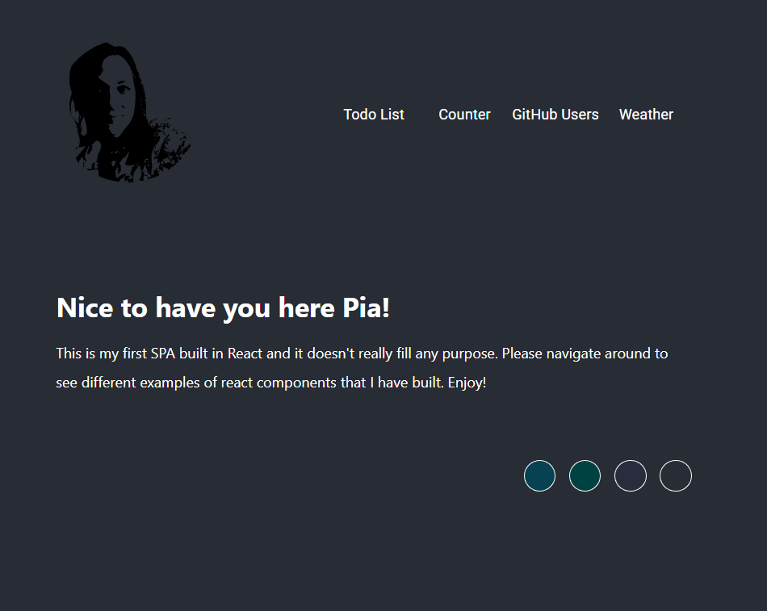
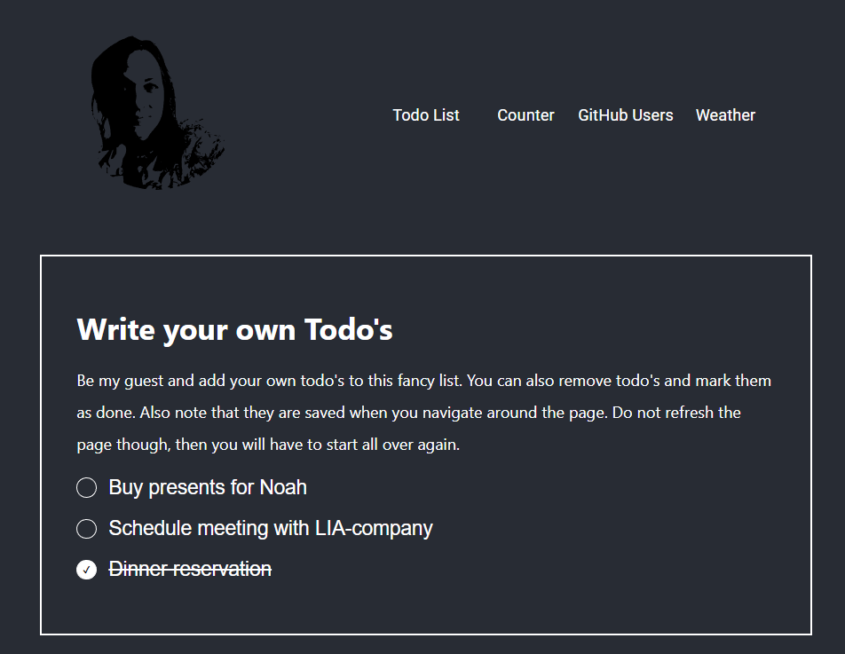
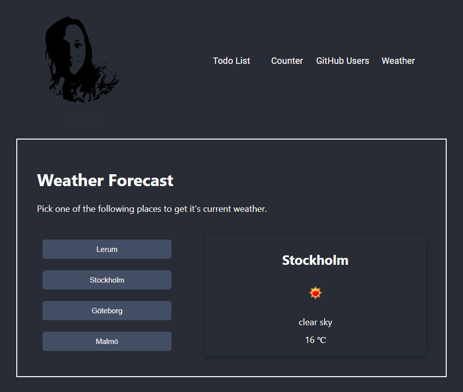
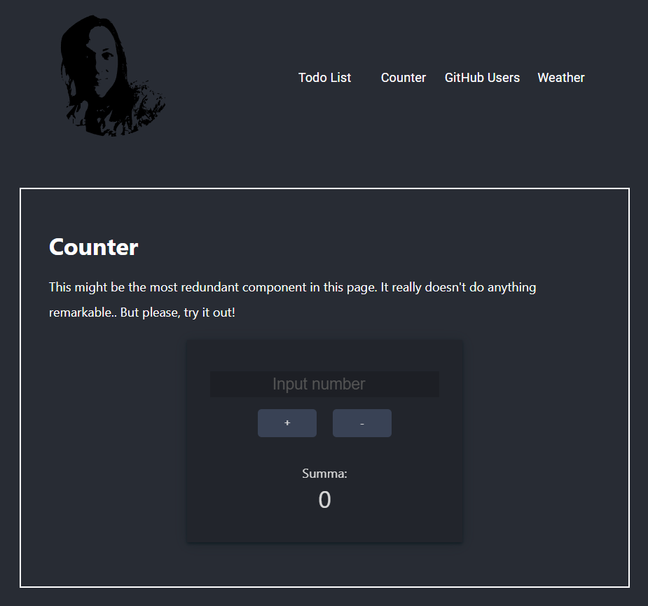
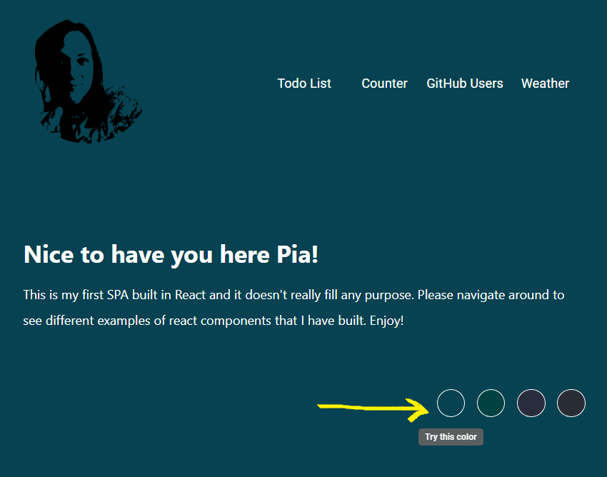

# My First React App

_EC Utbildning, "React" september 2022_
 
_Pia Hagman_

This is my first SPA built in React, which was done as one of the assignments in the course _React_ at _EC Utbildning_.
  
This app does not have a specific purpose, more than practicing how to use components, hooks and routing in React. It consists of 5 different routes (including index page) which use a couple of different components to make this page interactive with its user.
  

## Features/Components

Features of this app are:

### Todo List

In this todo list you can add and remove todo's, as well as mark them as done. They are saved by using useState hook.
  

### Weather Forecast

The weather component uses another component FetchData.jsx to get data from the external API [https://openweathermap.org/](https://openweathermap.org/). Potential improvements here would be that the user could pick a city of their own choice to fetch data for, since there is an inbuilt API request for this.   

### Forms

There are a few forms in this page. The first one is asking for your name input to welcome you, at index page and there is also a form in the counter component to be able to save take and save user input in the useState hook. The todo list is actually also built as a form.

### Open API calls

Except for the already mentioned API used in my Weather component, I made a call to [https://api.github.com/users](https://api.github.com/users) in my User.jsx component. The only reason I kept this component in this page was because I wanted to try how my FetchData.jsx worked when using it from different components. Otherwise it is quite redundant.

### Counter

A very simple counter witch I might want to expand to more of a calculator later on, when/if there is time. A good practice in using hooks.
  

### Change of Background Color

This was also good practicing, not least when it came to _lifting state up_ when I wanted the user choice of background color to consist even when navigating around in the page. And how this background color also affected other components background colors, using variables.
  

